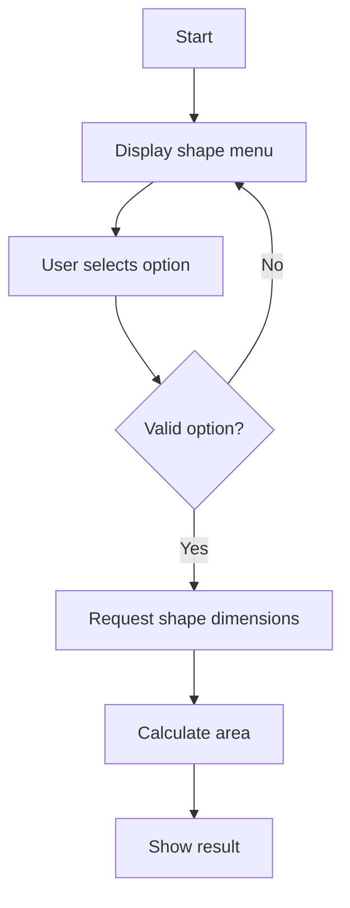

# 📐 Area Calculator – Python Project

An interactive Python calculator that allows the user to choose between four geometric shapes — **square, rectangle, triangle, and circle** — and calculate their respective areas based on the entered dimensions.

---

## 🚀 How It Works

> 💡 The code uses conditional structures (`if/elif`) and a `while` loop to ensure the user inputs a valid option.

---

## 🧮 Available Shapes

| Number | Shape      | Area Formula                 |
|--------|------------|------------------------------|
| 1      | Square     | side × side                  |
| 2      | Rectangle  | length × width               |
| 3      | Triangle   | (base × height) ÷ 2          |
| 4      | Circle     | π × radius²                  |

🔢 π is defined as `3.14` for simplicity.
